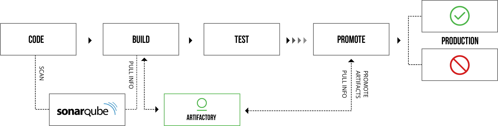
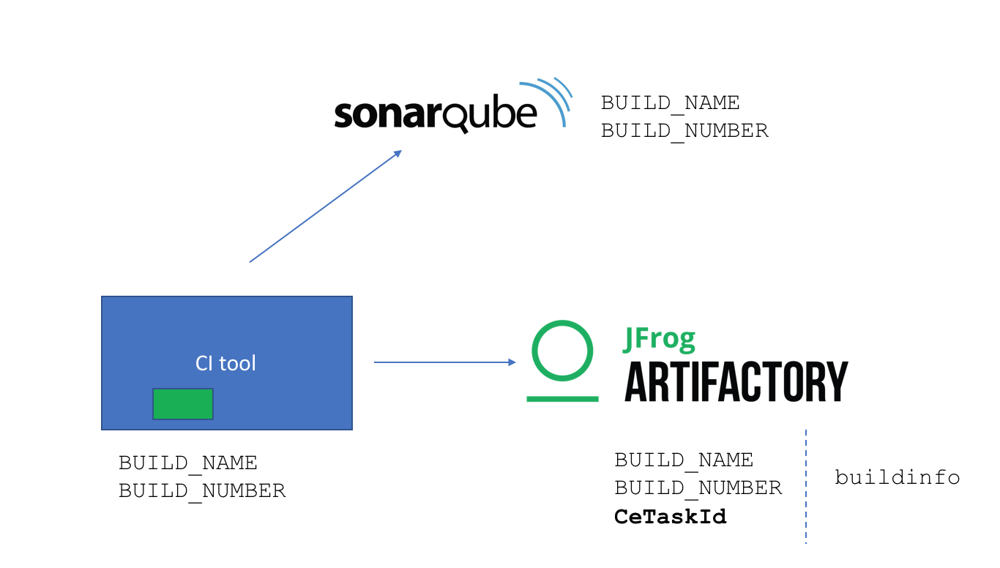

# SonarQube Integration with Artifactory Build-Info #

In your development environment, you might already be using SonarQube to scan your code to detect
security vulnerabilities, code smells, coverage and bugs, most likely via  [Quality Gate Metrics][8a22582c].
Now this integration allows the above information to be viewed in the context of a build( Artifactory build_info)

  [8a22582c]: https://docs.sonarqube.org/display/SONAR/Quality+Gates "SonarQualityGates"




This integration is also CI agnostic and can be used in many of the popular CI environments like Jenkins, Travis and CircleCI. The main integration component of interest is the supplied [artifactory-sonar.sh](https://github.com/jfrog/jfrog-integrations/blob/master/sonarqube/artifactory/artifactory-sonar.sh). Full details are listed below.


## Prerequisites for this integration ##

1. Build machine already has all the dependencies installed (e.g curl, grep, sed, awk, jq )


2. Build enviroment is configured to run with sonar analysis and quality gate meterics defined for the  project.

3. Environment variables ARTIFACTORY_USER, ARTIFACTORY_APIKEY, ARTIFACTORY_URL and ARTIFACTORY_REPO have to be set in CI pipeline scripts like Jenkinsfile or saved in a local file for example in ~/jfrogsonar.env which can be sourced before invoking the script.


## How to use the artifactory-sonar integration ##

It is recommended to use the artifactory-sonar integration  script as a reference as pipelines and conventions vary from company to company. Artifactory-Sonar integration can be used in **WAIT**  (blocking) mode or **NOWAIT** (non-blocking) mode. Wait mode is the default mode.



#### WAIT MODE ####

In the wait mode, the script waits for the sonar analysis to complete, so the build-info has the complete quality gate status information. The information that is captured in the build_info includes the sonar compute engine task id referred to as the CeTaskId,  the status of quality gate analysis referred to as the taskStatus,the sonar analysis id, the overall quality gate status, and the metric key name and status of all the quality gate conditions. Based on the quality gate condition status, the build can be marked as failed.

This mode is enabled when environment  variable WAIT_FOR_ANALYSIS is set to "true", which is also the default.

Invoke the script artifactory-sonar.sh in the post-build phase of your CI pipeline.

e.g in a typical Jenkinsfile

```
stage('Post Build') {

    sh -c ". ~/jfrogsonar.env; ./artifactory-sonar.sh"

}
```

If we do not want to fail the build, invoke the script with the argument "false".

    ./artifactory-sonar.sh false


#### NOWAIT MODE ####

In the no-wait mode, the script does not wait for the analysis to complete. This mode is enabled when
the environment variable WAIT_FOR_ANALYSIS is set to "false".

To invoke in no wait mode, execute

    export WAIT_FOR_ANALYSIS=false; ./artifactory-sonar.sh

The information that is captured in the build_info includes CeTaskId and the taskStatus which will be PENDING. The CeTaskId can be used to get the analysis id and quality gate information as implemented in the function waitForAnalysisToComplete() in the
artifactory-sonar.sh script.

This information can be used in deciding whether to promote this build or not in the pipeline.


## Integration Script ( artifactory-sonar.sh ) details ##

When the Intgeration script artifactory-sonar.sh is invoked, it does the following :

1. If the project build is integrated with sonar, then after every build, a file report-task.txt, referred to as "sonar report file" is produced by sonar. The location of this file varies. In case of maven build, will be in target/sonar directory. This file contains the Sonar Compute Engine Task Id referred to as the CeTaskId and the sonar server url as well  as the dashboard url and the project id. The script checks  if the sonar report file exists in the standard places and uses the sonar CeTaskID and the server url to check the status of the sonar task.

2. Even though build completed and report-task.txt got published, the analysis may not be complete as it is an asynchronous process on the sonar server. So in order to get the analsyis id, the script waits for the analysis to complete by default.  The CeTaskId is used to query the server for status in a loop for this purpose. This beahvior can be changed by setting envonemnt variable WAIT_FOR_ANALYSIS to false which will make the script to not wait for anaylysis to complete.

3. The script at this times exports two environment variables SONAR_CETASKID set to the CeTaskId and SONAR_TASKSTATUS set to PENDING if enviroment variable WAIT_FOR_ANALYSIS set to false. If WAIT_FOR_ANALYSIS is set, and we got analysis id, then the status will be SUCCESS. (Otherwise, it maybe FAILED or CANCELLED)

4. If the status is success, analysis id is obtained and from the analysis id quality gate status is obtained and  quality gate conditions are unravelled and the following enviroment variables are set.

    SONAR_ANALYSIS_ID,

    SONAR_QGATESTATUS.

    There will be an evironment variable for every metric in the Qualtiy Gate condtion with the value set to its status. For if there are five quality gate conditions, you will see the following enviroment varaibles being set.

    SONAR_new_security_rating=ERROR;

    SONAR_new_reliability_rating=OK;

    SONAR_new_maintainability_rating=OK;

    SONAR_coverage=ERROR;

5. The script will install jfrog cli and connects to artifactory, collects all the environment variables and publishes to artifactory. The build info environment details can be viewed in the artifactory.


6. If quality gate status has failed, the script will exit with status 1, so the build can be failed.

7. Script execution options.

    a. The script can be executed with WAIT_FOR_ANALYSIS=false. This is recommended to ensure builds complete quickly in cases where analysis time is very long. In this case, the script will not wait for analysis to complete, and just sets the task id and status which will be pending and the build info with these two variables will get publishde. Of course, if we do not wait for analysis to complete, so we will not have quality gate status and so we will not be able to fail the build even if enabled.

    b. The script can be executed with argument false, which will not fail the build when quality gate status is ERROR.

8. The curl commands in the script need to be modified based on the SonarQube authentication approach adopted.

9. The artifacts to be uploaded will also require changes based on the project being built.

## Sample Jenkinsfile ##

The sample [Jenkinsfile](https://github.com/jfrog/jfrog-integrations/blob/master/sonarqube/artifactory/Jenkinsfile) shows how and where it can be invoked.

## Test environment details ##

1. SonarQube 7.2
2. Artifactory 6.0
3. Jenkins


## Uses of this integration ##

It is now possible to tie a build info with the quality gate status and track the progress
of quality improvements with data recorded in artifactory even if sonarqube data for each build is not saved and available.

It is also useful for other JFrog tools  to use the
SonarQube quality data available in the build info and display it with other useful
information.

## Future Steps ##

1. Client GUI products can use the quality gate information directly or obtain the details from the CeTaskID.
2. We can utilize webhooks in SonarQube to indicate when analysis completes and inform listeners and the listener applications can then be configured to utilize the quality gate information.
3. Direct integration with other JFrog products.

## References ##

1. JFrog Artifactory:  http://www.jfrog.com
2. SonarQube : http://www.sonarsource.com
3. JFrog Integration : https://github.com/jfrog/jfrog-integrations/tree/master/sonarqube/artifactory
